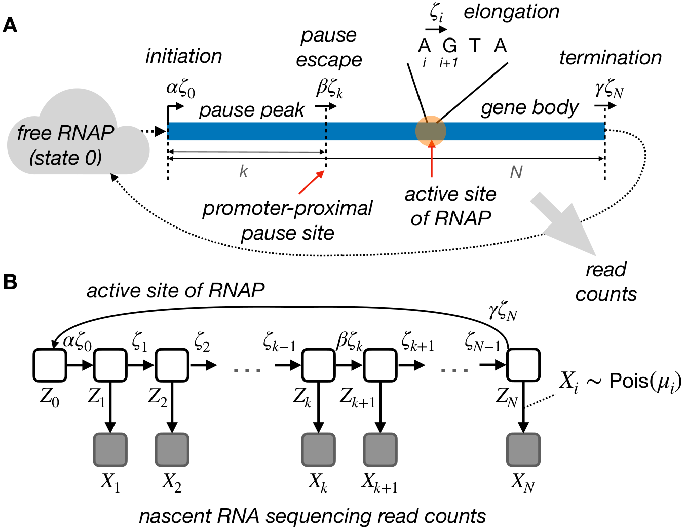

# Model-based characterization of the equilibrium dynamics of transcription initiation and promoter-proximal pausing in human cells

## Overview
In our manuscript, we described our initial model and two types of extensions.
One allows pause sites to vary across cells, and the other allows for both varied pause sites and steric hindrance of initiation at steady state. Here, we provide scripts of the implementation, and illustrate how we can use them to estimate initiation rates, pause release rates
and landing pad occupancy for both synthetic and experimental data.

<p align="center">
  
</p>

<p align = "center">
	Fig. 1 The initial probabilistic model for transcription initiation, promoter-proximal pausing, and elongation
</p>

## Dependencies

The unified model is implemented in the statistical programming language [R](https://www.r-project.org/), and depends on a couple of packages. One of the easiest ways to install them is via [conda](https://docs.conda.io/en/latest/).

```
conda create -n unimod --file environment.yml
```

Once installed, you can activate the environment then run the examples within it,

```
conda activate unimod
```

Test data could be downloaded from [here](http://compgen.cshl.edu/yizhao/unimod/data/), and assumed to be placed within the data directory.

## Examples

### Estimate rates based on simulated data

```
Usage: ./estimate_rates_simulation.R [options]
Estimate transcription rates based on simulated data

Options:
	-h, --help
		Show this help message and exit

	-r CHARACTER, --rds=CHARACTER
		Input file produced by SimPol [default NULL]

	-s LOGICAL, --steric=LOGICAL
		Infer landing-pad occupancy or not [default FALSE]

	-d CHARACTER, --outputDir=CHARACTER
		Directory for saving results [default .]
```

The input data is produced by [SimPol](https://github.com/CshlSiepelLab/SimPol), a simulator we developed for simulating the dynamics of RNA Polymerase (RNAP) on DNA template. One of the outputs from SimPol, pos.RDS, records the last 100 steps of the simulation, containing the information of RNAP positions in every cell. Therefore, we can utilize this information to sample cells, then sample read counts conditional on local RNAP frequency. We can later use this synthetic read counts to infer the transcription rates. The whole process is finished by doing

```
./estimate_rates_simulation.R -r ../data/k50ksd25kmin17kmax200l1950a1b1z2000zsd1000zmin1500zmax2500t40n20000s33h17_pos.RDS -d ../outputs/simulation
```

The prefix "k50ksd25kmin17kmax200l1950a1b1z2000zsd1000zmin1500zmax2500t40n20000s33h17" of the input file
indicates the parameters we used in this test data set, which is further explained [here](https://github.com/CshlSiepelLab/SimPol#usage). Under the given parameters, we simulated 20,000 cells in total for the equivalent of 40 min. (400,000 time slices). We then randomly sampled 5,000 of the 20,000 cells 50 times for each run. The output csv file contains the following columns:

1. trail, refers to the number of run, from 1 to 50
2. chi, the $\chi$ estimates
3. beta_org, the $\beta$ estimates from the initial model
4. beta_adp, the $\beta$ estimates from the adapted model which allows pause sites to vary across cells

Details of the model and the simulation could be found in the method section [here](https://www.biorxiv.org/content/10.1101/2022.10.19.512929v1.full).

We can also use the same R script to infer landing-pad occupancy,

```
./estimate_rates_simulation.R -r ../data/k50ksd25kmin17kmax200l1950a1b1z2000zsd1000zmin1500zmax2500t40n20000s33h17_pos.RDS -s T -d ../outputs/simulation
```

And in this case, a fifth column phi will show up in the result. These are the $\phi$ estimates referring to the occupancy.  

### Estimate rates based on experimental data

In this section, we will demonstrate how to use the model to estimate transcription rates on real data.

```
Usage: ./estimate_rates_experiment.R [options]
Estimate transcription rates based on experimental data

Options:
	-h, --help
		Show this help message and exit

	-v, --verbose
		Print messages [default]

	-q, --quietly
		Print no messages

	--bwp=CHARACTER
		Input bigwig file from the plus strand [default NULL]

	--bwm=CHARACTER
		Input bigwig file from the minus strand [default NULL]

	--grng=CHARACTER
		Gene regions for read counting [default NULL]

	-s LOGICAL, --steric=LOGICAL
		Infer landing-pad occupancy or not [default FALSE]

	--scale=CHARACTER
		A file provides scaling factors for omega [default NULL]

	--type=CHARACTER
		Scale omega based on [L]ow or [H]igh initiation rate [default L]

	-d CHARACTER, --outputDir=CHARACTER
		Directory for saving results [default .]

```  

Like what we did in the simulation section, users need to download the [test data]((http://compgen.cshl.edu/yizhao/unimod/data/)) first. The plus.bw and minus.bw files are bigWig files recording PRO-seq read counts, which can be generated via the [proseq2.0](https://github.com/Danko-Lab/proseq2.0) pipeline. In addition, we also need pause and gene body regions for every gene in order to do the read counting. The "granges_for_read_counting.RData" saves these regions for analysis in K562 cells. Essentially, we used CoPRO-cap to precisely determine active TSS, then use these refined TSS to generate regions for read counting. Further details could be found in the "Analysis of Real Data" section [here](https://www.biorxiv.org/content/10.1101/2022.10.19.512929v1.full).    

```
./estimate_rates_experiment.R --bwp ../data/PROseq-K562-vihervaara-control-SE_plus.bw --bwm ../data/PROseq-K562-vihervaara-control-SE_minus.bw --grng ../data/granges_for_read_counting.RData  
```

After running this script, a csv file with following columns will be generated:

1. gene_id, Ensemble gene id
2. chi, the $\chi$ estimates
3. beta_org, the $\beta$ estimates from the initial model
4. beta_adp, the $\beta$ estimates from the adapted model which allows pause sites to vary across cells
5. fk_mean, the mean position of pause sites
6. fk_var, the variance of the position of pause sites

We can also use the same R script to infer landing-pad occupancy $\phi$, but in this case, we will
have to scale omega first as we discussed in [our manuscript](https://www.biorxiv.org/content/10.1101/2022.10.19.512929v1.full). We provide "scale_factor.csv" containing the scaling factors we precomputed in K562 cells.  

```
./estimate_rates_experiment.R --bwp ../data/PROseq-K562-vihervaara-control-SE_plus.bw --bwm ../data/PROseq-K562-vihervaara-control-SE_minus.bw --grng ../data/granges_for_read_counting.RData -s T --scale ../data/scale_factor.csv
```

In addition to the columns above, four more columns will be included:

7. phi, $\phi$ estimates referring to the occupancy
8. omega_zeta, $\omega$ is the effective initiation rate
9. beta_zeta, $\beta$ is the pause escape rate
10. alpha_zeta, $\alpha$ is the potential initiation rate

Note the last three columns are multiplied by the elongation rate, $\zeta$, which is assumed to be
2,000 bp/min. So all these columns have the absolute unit "events per minute".

## Citation
Zhao, Y., Liu, L. & Siepel, A. Model-based characterization of the equilibrium dynamics of transcription initiation and promoter-proximal pausing in human cells. 2022.10.19.512929 Preprint at [bioRxiv](https://doi.org/10.1101/2022.10.19.512929) (2022).
